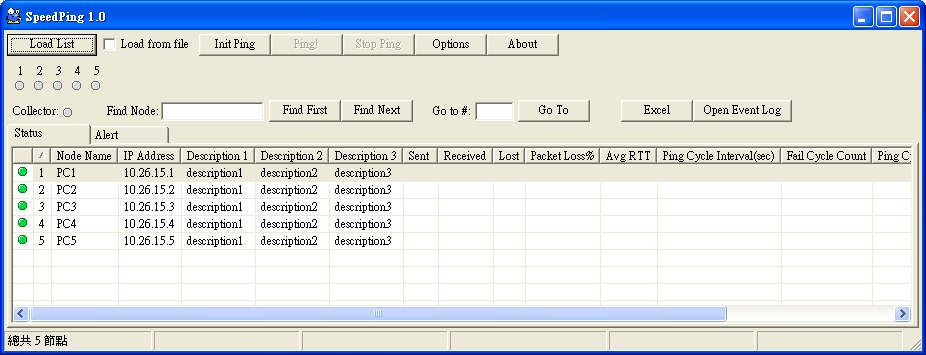



## speed ping

### Description

Ping thousands of node in very very short time. My test, 10000 nodes just need 15 to 20 seconds one cycle. You can adjust the pingagent number to speed it up.

The trick is to use async ping and share memory.

I think this is the fast ping program of the world.
 
### More Info
 

             |
---                |---
**Submitted On**   |2010-12-31 11:52:20
**By**             |[Red Corn](https://github.com/Planet-Source-Code/PSCIndex/blob/master/ByAuthor/red-corn.md)
**Level**          |Advanced
**User Rating**    |5.0 (10 globes from 2 users)
**Compatibility**  |VB 6\.0
**Category**       |[Complete Applications](https://github.com/Planet-Source-Code/PSCIndex/blob/master/ByCategory/complete-applications__1-27.md)
**World**          |[Visual Basic](https://github.com/Planet-Source-Code/PSCIndex/blob/master/ByWorld/visual-basic.md)
**Archive File**   |[speed\_ping220572642011\.zip](https://github.com/Planet-Source-Code/red-corn-speed-ping__1-73936/archive/master.zip)

